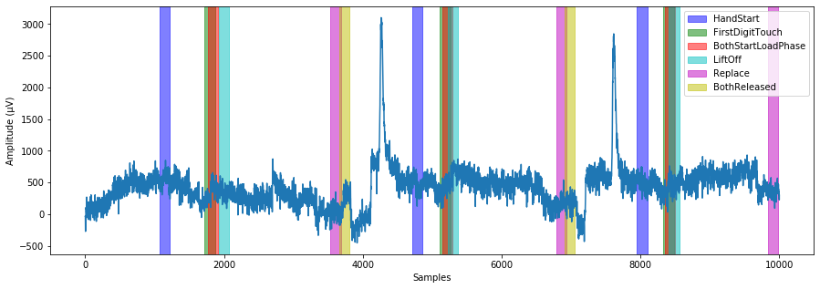
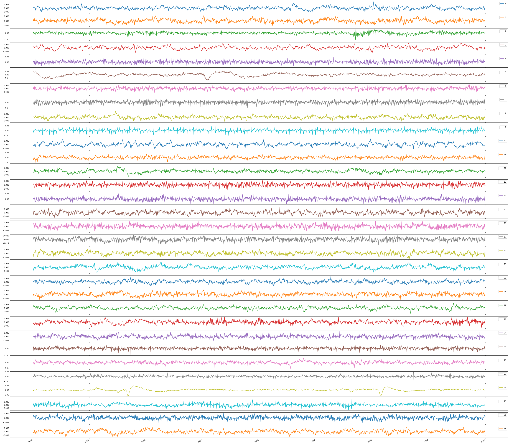
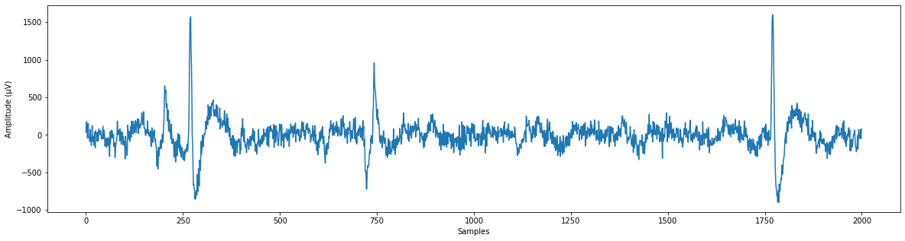
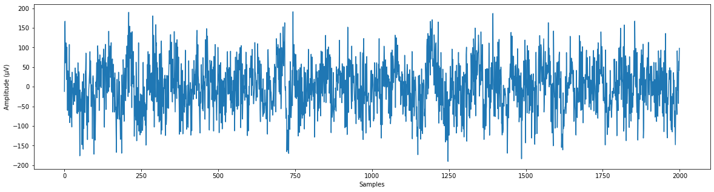

# Grasp-and-Lift EEG Detection
This repository contains the code used for research into the detection of events during grasp-and-lift trials using EEG signals, based on the Grasp-and-Lift EEG Detection Kaggle competition https://www.kaggle.com/c/grasp-and-lift-eeg-detection . This readme outlines the methodology and results. 

## Table of Contents
[Project Overview](#project-overview) 
- [Task](#task)
- [Grasp-and-Lift](#grasp-and-lift)
- [EEG Data](#the-eeg-data)
- [Predictions and Evaluation](#predictions-and-evaluation)
- [Approach](#approach)

[Preprocessing](#preprocessing)
- [Time-Domain Filtering](#Time-domain-Filtering)
  - [Filter Implementation](#Filter-Implementation)
- [Decimation](#Decimation)
- [Artifact Removal](#Artifact-Removal)
  - [Filtering](#Filtering)
  - [Independent Component Analysis](#Independent-Component-Analysis)

[Feature Extraction](#Feature-Extraction)
- [Epoching](#epoching)
- [Time-Domain Features](#Time-Domain-Features)
- [Frequency-Domain Features](#Frequency-Domain-Features)
- [Principal Component Analysis](#Principal-Component-Analysis)

[Classification](#classification)
- [Subject-Specific Models](#Subject-Specific-Models)
- [Regularisation](#Regularisation)
  - [Grid Search](#Grid-Search) 

[Results](#Results)

[Discussion](#Discussion)
- [Future Work](#Future-Work)

## Project Overview
#### Task
The overall aim of this work is to research how different signal processing and machine learning techniques and algorithm parameters impact the detection of the distinct parts of a 'grasp-and-lift' (GAL) using the recorded electroencephalogram (EEG) signals. The motivation behind being able to accurately predict events or intention in EEG data is an improved quality of life for amputees and those with neurological disorders. In the case of GAL detection, feeding the predictions into a robotic prosthesis would return some functionality back to upper-limb amputees. 

#### Grasp-and-Lift
The GAL is defined as 6 distinct events, taking place in the same order, as:
1. HandStart - reach for small object
2. FirstDigitTouch - grasp object with index finger and thumb
3. BothStartLoadPhase - lift the object a few centimetres
4. LiftOff - hold it in the air for a few seconds
5. Replace - place the object back down
6. BothReleased - release the object 

#### The EEG Data
The dataset downloaded from Kaggle consists of the EEG recordings for 12 different subjects. Each subject has 10 series of recordings, each of which contains 30 GALs. There are 32 channels of EEG data recorded (i.e. 32 sensors). The data was originally sampled at 5 kHz and subsequently downsampled to 500 Hz. Further information about the data acquisition can be found at: https://www.nature.com/articles/sdata201447 .

Each sample of EEG data has a corresponding one-hot encoded events vector, with one column for each event. A 1 in a column means the event has occurred within +-150 ms of that sample. The image below shows the first 20 seconds of subject 1s data from channel 1, with the events overlaid. The events overlap, making this a multi-label classificaton problem.

#### Predictions and Evaluation
The aim is to predict the *probability* of each GAL event happening at each sample, rather than the 1 or 0 class label. The reason for this is that the evaluation metric used in the Kaggle competition is the area under the receiver operating characteristic curve (AUROC), averaged across all the events. The ROC curve plots true positive rate vs false positive rate, for different decision probability thresholds, i.e. the probability at which the decision becomes 1. For example, a classifier with decision probability threshold = 0.1 is going to make far more positive (i.e. 1) decisions than a classifier with decision probability threshold = 0.9, it will be much more sensitive but much less specific. Depending on the application, one is more important than the other. The main advantage of using the AUROC is that predictions can be evaluated without having to decide on the decision probability threshold. Good classifiers will have an AUROC closer to 1, as they can have a large true positive rate whilst maintaining a smaller false positive rate.

#### Approach
The top scores on the Kaggle leaderboard for this challenge are AUROCs of 0.97+. These very high-scores are obtained using deep learning model ensembles, i.e. very computationally intensive approaches. This requires the use of a GPU (or GPUs) for realistic training times, and their suitability for real-life real-time application is questionable. Therefore, this work is focused on how preprocessing and feature extraction techniques (less computationally costly processes than classifier optimisation/training) can improve classification. Because I am interested in testing quite a few different techniques and parameters, logistic regression is used as the classifier to keep training times down. 

A note on testing: the Kaggle submission restriction of 4 per day prevents testing a large number of different algorithms. For this reason, the testset used is the 7th and 8th series of the training set, for which we have labels to compute the AUROC score.

## Preprocessing

#### Time-Domain Filtering
The frequency components of the EEG signals change depending on the type of brain activity. Rhythms, frequency ranges corresponding to frequencies exhibited in EEG signals during different types of activity, are typically defined as delta (0.5-4 Hz), theta (4-8 Hz), alpha (8-13 Hz), beta (13-30 Hz) and gamma (30-80 Hz). Because the signals have frequency components up to 250 Hz (500 Hz sampling frequency), the first step therefore is to remove frequency components outside this useful range by bandpass filtering the signals between 0.5-80 Hz. As evidenced in filter_testing.ipynb, mains interference at 50 Hz has already been removed. 

##### Filter Implementation
The signals are filtered causally, using only the present and past samples as to prevent data leakage (a BCI in real-life doesn't have access to future data). A problem with causal filters is that they introduce a time delay to the filtered signals (see filter testing.ipynb for an example). This is an issue for supervised learning where each sample has a corresponding label at the same time. In general, the larger the order of the filter the larger the time delay, and the larger this issue. With this in mind, whilst FIR filters are desirable to use with EEG signals because they have a linear phase, thus the time-domain signal is not distorted within the passband frequencies, they are genereally higher order than IIR filters, and so suffer from a greater time delay. This is illustrated in the filter_testing.ipynb notebook. For this reason, 4th order IIR filters are used. A 4th order Butterworth IIR filter is implemented using SciPy with the `butter` functon to obtain the filter coefficients. `lfilter` is then used to causally filter the signals.  

#### Decimation
To reduce the computational costs of model training, the signals are downsampled. Because downsampling lowers the sampling rate, low-pass filtering is necessary to prevent aliasing from higher frequency components (above half the new sampling rate). As above, the signals are low-pass filtered with a cutoff frequency of 80 Hz. As per Nyquist sampling theorem, the sampling frequency must therefore be at least 160 Hz to avoid aliasing. This allows for downsampling by taking every 3rd sample (500/160=3.125), resulting in a new sampling frequency of 166.6 Hz.

#### Filter Bank
The use of a filter bank is tested; a set of five bandpass filters with cutoff frequencies corresponding to the brain rhythms defined previously. The idea behind this is . The use of the filter bank results in 160 channels of EEG data (5 frequency bands for 32 channels).

#### Artifact Removal
EEG signals are contaminated with *artifacts*; signals not produced by brain activity but picked up in the EEG recordings. These artifacts often have a greater amplitude than the signals generated in the brain and thus can obscure the actual brain activity, in turn making the classification more difficult. 

Common artifacts found in EEG signals arise from both physiological/internal (e.g. blinking (EOG), heart beat (ECG), muscle activity (EMG) and breathing) and non-physiological/external (e.g. mains interference, cable movement) sources. To improve classification performance, these artifacts should be removed. Ideally, all artifacts would be removed, leaving only the signals produced directly from brain activity. One must take care however as the removal of artifacts inadvertently results in the loss of useful EEG information. 

##### Filtering
With the signal filtering described above, high frequency (>80 Hz) noise e.g EMG signals, low frequency (< 0.5Hz) movement artifacts (e.g. breathing) and DC offset are all removed. 

##### Independent Component Analysis 
Filtering only removes artifacts that have frequency components outside the 0.5-80 Hz range, so another technique is required to remove remaining artifacts. Independent component analysis (ICA) is a technique that can decompose the 32 channels of EEG data into 32 statistically independent sources, from which the artifacts can be indentified and rejected. 

ICA is implemented with the `FastICA` algorithm from Scikit-learn. For each subject, the independent components (unmixing matrix) are computed and the EEG signals transformed into the independent sources. The components are not ordered in any way, and so the artifacts can appear in any channel, thus identification of artifacts requires manual inspection using https://labeling.ucsd.edu/tutorial/labels . The plot of independent sources for subject 1 is shown below:

Eyeblink artifacts can be seen in channel 31. To reject this artifact, the 31st independent source is zeroed prior to taking the inverse transformation. The removal of eyeblinks using ICA can be seen in channel 1 of subject 1s data:

Original data

Cleaned channel of data

At this stage, only eyeblink artifacts are removed to prevent the loss of too much useful information.

## Feature Extraction
Features are extracted from the EEG signals for two main reasons: (1) extract useful information whilst removing noise to improve classification performance and (2) to reduce the amount of data and therefore computational costs.

#### Epoching
The signals are split into segments of data known as epochs, from which a set of features are extracted. A sliding window is used to pass through the data, extracting features as it goes. The length of the window, dictating how much previous information is useful for predictions at the current time, is an important parameter affecting classification performance. Therefore, windows of 0.25, 0.5, 1 and 2 seconds are tested, all with 50% overlap. The set of features extracted from a window take the label of the the final sample in that window.

#### Time-Domain Features
The first type of feature extracted from each epoch are temporal features, describing the signals amplitude over time. For each epoch, simple statistical properties (maximum, minimum and mean absolute value) and Hjorth parameters (activity, mobility, complexity) are extracted. 

#### Frequency-Domain Features
Spectral features are also extracted from the frequency-domain of the signals. For each epoch, the power spectral density (PSD) estimate, describing the power of the signal at different frequencies, is computed. Welch's PSD estimate reduces the variance of the estimate over a simple periodogram and the use of a window function reduces spectral leakage. Welch's PSD estimate is computed with SciPy's `welch` function, with 50% overlap between segments and a Hann window function. From the PSD of each epoch, the maximum power and the frequency at which maximum power occurs are extracted, as well as the average power across each quarter of the PSD (average across each quarter used rather than the PSD itself to reduce number of features). 

#### Principal Component Analysis
Extraction of multiple features from multiple channels of EEG data results in a highly dimensional feature space, inevitably containing redundant features that can worsen classification performance and increase training times. It can therefore be useful to reduce the dimensonality of the feature space by removing the redundant information and keeping the useful information. 

Principal component analysis (PCA) is one such technique used for dimensionality reduction. With the assumption that variance in the dataset is important, PCA finds the orthonormal vectors, known as components, that describe the greatest variance in the feature space. The data is transformed using the components, and dimensionality reduced by selecting a subset of feature that explain a large amount of the variance. PCA is implemented with Scikit-learn, and the number of features kept was set as `n_components=0.95`, using the number of components that cumulatively explain 95% of the variance in the feature space. PCA is applied after normalisation as it is sensitive to feature scales. 

## Classification
Logistic regression, a binary classifier, is extended to multiclass and multilabel classification by constructing a *one-vs-rest* classifier, in which a logistic regression model is trained for each class, where the remaining 5 classes are considered the other class. For example, a model is trained to predict *HandStart* or *not HandStart*, and another is trained to predict *FirstDigitTouch* or *not FirstDigitTouch*. This is implemented in scikit-learn with the `OneVsRestClassifier` wrapper that contains the 6 models. 

#### Subject-Specific Models
The characteristics of the EEG signals in both time and frequency domain vary between different subjects. Therefore, a classifier trained on one subjects features won't perform well on another subjects features. For this reason, a one-vs-rest classifier is trained for each subject, resulting in 12 classifiers per algorithm. On a side note, subject-independent models have been successful using deep-learning approaches, where using data from different subjects serves as a type of regularisation. For real-life use, this would have the advantage of reducing or foregoing a calibration period for a user. 

#### Regularisation
When the coefficients of a logistic regression model get too large, the model becomes too complex and can't generalise well to unseen data, an issue known as overfitting. Regularisation is used to reduce overfitting during training by penalising large weight values through the use of a penalty term added to the loss function. Both L1 and L2 regularisation are used:
- L1 penalty - the sum of the absolute value of the weights is added to the loss function. L1 regularisation acts as a type of feature selection as the coefficients of unimportant features are often shrank to zero rather than just reduced. 
- L2 penalty - the sum of the squared value of weights is added to the loss function.

##### Grid Search
A coefficient before the penalty terms control the strength of regularisation. If the coefficient is too small, the model becomes too complex and overfits the data, and vice versa with a coefficient that is too large. It's therefore an important hyperparameter that needs to be optimised. A grid search is used to find the optimal penalty coefficient by testing on a holdout validation set (70-30 training-validation split) and choosing the coefficient corresponding the largest AUROC. 

## Results
Summary of what has been being tested:
- Single 0.5-80 Hz bandpass filter vs filter bank approach
- No ICA vs eyeblink artifact removal with ICA
- Feature extraction window length - 0.25, 0.5, 1 and 2 seconds
- No PCA vs PCA for dimensionality reduction
- L1 vs L2 penalties in logistic regression

**64 algorithms tested in total**

Note that all three metrics - training time, number of features and the AUROC score are all averaged across all subjects. 

| ICA   | Filter      |   Window length | PCA   | Penalty   |   Train time |   No. feats |   AUROC |
|-------|-------------|-----------------|-------|-----------|--------------|-------------|---------|
| False | bandpass    |            0.5  | False | l2        |        8.048 |     291     |   0.798 |
| False | bandpass    |            0.25 | False | l2        |       18.447 |     291     |   0.788 |
| False | bandpass    |            0.5  | False | l1        |       16.852 |     275.625 |   0.783 |
| False | filter bank |            1    | False | l2        |        7.422 |    1443     |   0.783 |
| False | filter bank |            0.5  | False | l2        |       24.936 |    1443     |   0.782 |
| False | filter bank |            0.25 | False | l2        |       54.911 |    1443     |   0.779 |
| False | bandpass    |            1    | False | l2        |        3.621 |     291     |   0.778 |
| False | bandpass    |            0.25 | False | l1        |       35.112 |     279.819 |   0.778 |
| False | filter bank |            1    | True  | l2        |        0.465 |     398.583 |   0.776 |
| False | filter bank |            1    | False | l1        |       48.758 |    1063.75  |   0.774 |
| False | filter bank |            0.5  | False | l1        |       96.66  |    1264.1   |   0.774 |
| False | filter bank |            0.25 | True  | l2        |        3.298 |     396.833 |   0.772 |
| True  | bandpass    |            0.5  | False | l2        |        7.716 |     291     |   0.772 |
| False | filter bank |            0.25 | False | l1        |      201.602 |    1011.96  |   0.772 |
| False | filter bank |            0.5  | True  | l2        |        1.165 |     315.917 |   0.77  |
| False | filter bank |            1    | True  | l1        |        9.621 |     264.208 |   0.769 |
| False | bandpass    |            0.5  | True  | l2        |        0.592 |      80.917 |   0.769 |
| False | filter bank |            0.25 | True  | l1        |       44.339 |     337.139 |   0.766 |
| True  | bandpass    |            0.25 | False | l2        |       17.19  |     291     |   0.766 |
| False | filter bank |            0.5  | True  | l1        |       15.392 |     252.944 |   0.765 |
| False | bandpass    |            0.5  | True  | l1        |        4.333 |      76.389 |   0.764 |
| False | bandpass    |            1    | False | l1        |        8.453 |     274.319 |   0.762 |
| True  | bandpass    |            0.5  | False | l1        |       16.723 |     279.042 |   0.758 |
| True  | bandpass    |            1    | False | l2        |        2.793 |     291     |   0.758 |
| False | bandpass    |            0.25 | True  | l2        |        0.944 |      87.167 |   0.755 |
| True  | filter bank |            0.5  | False | l2        |       22.737 |    1443     |   0.755 |
| True  | bandpass    |            0.5  | True  | l2        |        0.688 |      95.25  |   0.755 |
| True  | bandpass    |            0.25 | False | l1        |       34.79  |     270.986 |   0.755 |
| True  | filter bank |            0.25 | False | l2        |       60.028 |    1443     |   0.753 |
| False | bandpass    |            0.25 | True  | l1        |        7.45  |      84.736 |   0.752 |
| True  | filter bank |            1    | False | l2        |        7.336 |    1443     |   0.751 |
| True  | bandpass    |            0.5  | True  | l1        |        4.852 |      87.278 |   0.749 |
| False | bandpass    |            1    | True  | l2        |        0.256 |      76.917 |   0.748 |
| True  | filter bank |            0.5  | False | l1        |       96.982 |    1121.1   |   0.746 |
| True  | bandpass    |            1    | False | l1        |        9.098 |     273.958 |   0.746 |
| True  | filter bank |            0.25 | False | l1        |      197.119 |     995.139 |   0.745 |
| True  | filter bank |            1    | True  | l2        |        0.41  |     417.417 |   0.744 |
| True  | bandpass    |            0.25 | True  | l2        |        1.307 |      99.333 |   0.744 |
| True  | filter bank |            0.25 | True  | l2        |        2.642 |     414.5   |   0.744 |
| True  | filter bank |            1    | False | l1        |       51.189 |    1190.67  |   0.743 |
| True  | filter bank |            0.5  | True  | l2        |        1.058 |     326.583 |   0.743 |
| True  | bandpass    |            1    | True  | l2        |        0.26  |      92.583 |   0.742 |
| False | bandpass    |            1    | True  | l1        |        1.95  |      72.181 |   0.742 |
| True  | bandpass    |            0.25 | True  | l1        |        8.721 |      93.153 |   0.741 |
| True  | filter bank |            0.5  | True  | l1        |       17.675 |     253.5   |   0.736 |
| True  | filter bank |            0.25 | True  | l1        |       44.99  |     341.972 |   0.736 |
| True  | bandpass    |            1    | True  | l1        |        2.727 |      76.944 |   0.734 |
| True  | filter bank |            1    | True  | l1        |       10.811 |     255.583 |   0.733 |
| False | filter bank |            2    | False | l2        |        3.889 |    1443     |   0.719 |
| False | filter bank |            2    | True  | l2        |        0.258 |     344.333 |   0.717 |
| False | filter bank |            2    | False | l1        |       27.897 |    1173.81  |   0.716 |
| False | filter bank |            2    | True  | l1        |        4.864 |     236.389 |   0.706 |
| True  | filter bank |            2    | False | l2        |        3.422 |    1443     |   0.701 |
| True  | filter bank |            2    | True  | l2        |        0.245 |     362.083 |   0.697 |
| True  | filter bank |            2    | False | l1        |       26.249 |    1099.14  |   0.69  |
| True  | filter bank |            2    | True  | l1        |        5.192 |     237.736 |   0.685 |
| False | bandpass    |            2    | False | l2        |        1.199 |     291     |   0.684 |
| True  | bandpass    |            2    | False | l2        |        1.402 |     291     |   0.679 |
| False | bandpass    |            2    | True  | l2        |        0.139 |      66     |   0.673 |
| False | bandpass    |            2    | True  | l1        |        0.879 |      49.167 |   0.669 |
| True  | bandpass    |            2    | True  | l2        |        0.175 |      80.917 |   0.668 |
| True  | bandpass    |            2    | True  | l1        |        1.034 |      53.014 |   0.644 |
| False | bandpass    |            2    | False | l1        |        3.578 |     146.181 |   0.611 |
| True  | bandpass    |            2    | False | l1        |        2.948 |     118.875 |   0.6   |

Total run time: ~ 1 day with i5-8250U processor, 4x1.60GHz Cores, 16 GB RAM

## Discussion
- **Artifact removal**: Using ICA to remove eyeblink artifacts lowers the AUROC across all algorithms. This is unexpected, given that a more cautious approach was taken with ICA to remove only eyeblink artifacts, given thir distinctive appearance, to prevent misidentification of artifacts and lose useful information. One possible reason is that eye activity actually contains useful class-discriminant information e.g. where the subject is looking. Subject-variability - 
- **Signal filtering**: Filtering the signals into the seperate brain rhythms improves performance for the longer windows of 1 and 2 seconds, but not for the windows of 0.25 and 0.5 seconds. One potential explanation for this is that 
- **Window length**: Window lengths of 0.25, 0.5 and 1 second all perform well. A window length of 2 seconds results in a significant drop in performance, with all the algorithms using a window length of 2 at the bottom of the table. This makes sense, 
- **Dimensionality reduction with PCA**: Algorithms using PCA see a decrease in AUROC, perhaps expected given the inherent loss of information. However, the reduction in number of features and in turn training time is significant. Furthermore, the use of PCA appears to work better when combined with a filter bank approach, in which many more features are created. 
- **Regularisation**: Algorithms using L2 regularisation perform better than their L1 counterpart. This could be because L1 regularisation prioritises a sparse solution, completely zeroing out coefficients. In contrast, L2 regularisation will shrink the coefficients of less useful features, but the features are still used, perhaps boosting performance slightly. Training time is increased with L1 regularisation, . It can be seen L1 regularisation does not reduce dimensionality as much as PCA, and there is no clear best feature selection technique. 
 
#### Future Work:
- General:
  - Use best algorithm on Kaggle test set and upload 
  - More in-depth statistical analysis of results
  - Algorithm comparison tool
 
- Independent component analysis:
  - More extensive artifact removal 
  - Automated the artifact identification process
- Preprocessing:
  - Frequency sub-bands for the filter bank
  - Automated artifact detection on the independent sources in ICA
- Feature Extraction:
  - Time-frequency domain features 
  - Covariance matrix as a feature 
  - Other dimensionality reduction methods e.g. sequential feature selection
- Classification 
  - Test different types of models (does the best algorithm for logistic regression translate to other models?)
  - Ensemble of classifiers
  - Postprocessing of model outputs to take into account previous model outputs e.g. hidden Markov model forward algorithm
