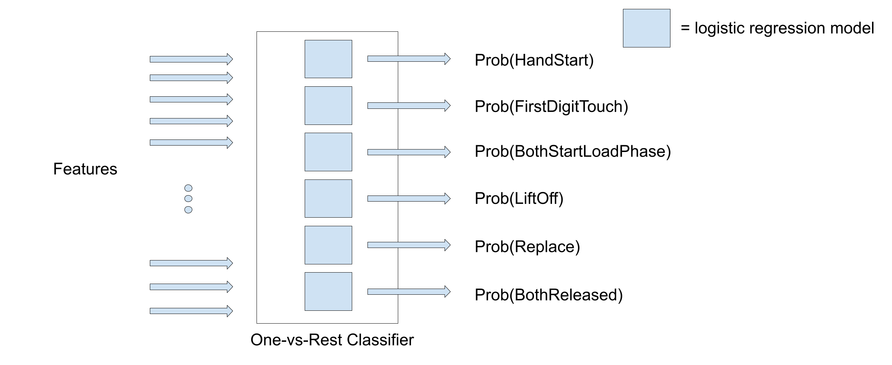

 A classifier model is trained to predict the probability of each gesture being performed through time. A large number of different supervised learning algorithms exist, each with their own advantages. For this work, logistic regression is used owing to its short training time, allowing for a large number of algorithms to be evaluated. 

---
---

## Logistic Regression
Logistic regression is a binary classifier, extended to multilabel classification by constructing a *one-vs-rest* classifier. For each class, a binary classification problem is defined and a model trained. For example, 
one model is trained to predict the probability of HandStart, and another to predict FirstDigitTouch. Practically, this is implemented in scikit-learn with the `OneVsRestClassifier` wrapper that contains the 6 individual models. 

## Subject-Specific Models
The characteristics of the EEG signals in both time and frequency domain vary between different subjects. Therefore, a classifier trained on one subject's features won't perform well on another subject's features. For this reason, a one-vs-rest classifier is trained for **each** subject, resulting in 12 classifiers per algorithm. On a side note, subject-independent models have been successful using deep-learning approaches, where using data from different subjects serves as a type of regularisation. For real-life use, this would have the advantage of reducing or foregoing a calibration period for a user. 

## Regularisation
When the coefficients of a logistic regression model get too large, the model becomes too complex and can't generalise well to unseen data, an issue known as overfitting. Regularisation is used to reduce overfitting during training by penalising large weight values through the use of a penalty term added to the loss function. Both L1 and L2 regularisation are used:
- L1 penalty - the sum of the absolute value of the weights is added to the loss function. L1 regularisation acts as a type of feature selection as the coefficients of unimportant features are often shrank to zero rather than just reduced. 
- L2 penalty - the sum of the squared value of weights is added to the loss function.

### Grid Search
A coefficient before the penalty terms control the strength of regularisation. If the coefficient is too small, the model becomes too complex and overfits the data, and vice versa with a coefficient that is too large. It's therefore an important hyperparameter that needs to be optimised. A grid search is used to find the optimal penalty coefficient by testing on a holdout validation set (70-30 training-validation split) and choosing the coefficient corresponding the largest AUROC. 
