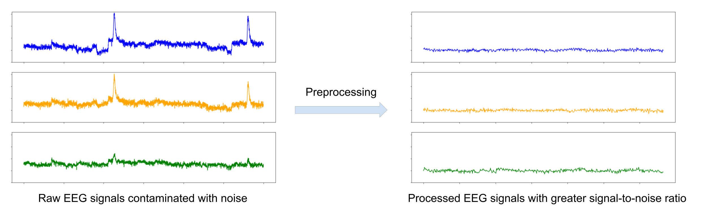
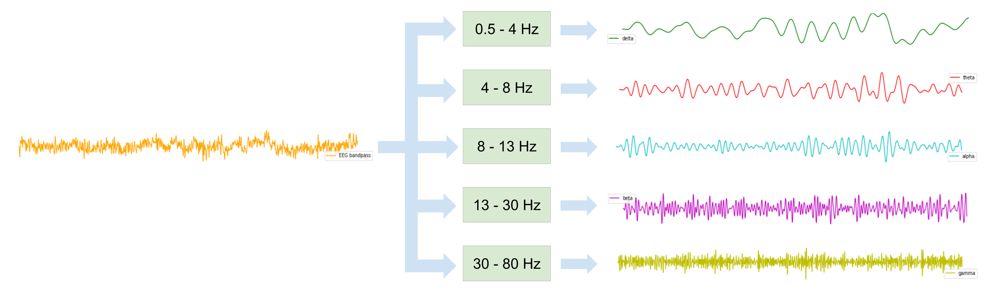

 Raw EEG signals are full of noise that can obscure or hide true brain activity in the signals, making the task of classification more difficult. The first step is therefore to process the raw EEG signals in an attempt to maximise signal-to-noise ratio. 

---
---

## Brain Rhythms
The main frequencies of the EEG signals change depending on the type of brain activity. Brain rhythms are frequency ranges corresponding to EEG signal frequencies exhibited during different types of activity. They are typically defined as delta (0.5-4 Hz), theta (4-8 Hz), alpha (8-13 Hz), beta (13-30 Hz) and gamma (30-80 Hz). Broadly speaking, the lower frequency delta and theta bands correspond to sleep and relaxation states, whilst the higher frequency alpha, beta and gamma bands are exhibited during times of wakefullness. The image below shows some raw EEG data filtered into the different rhythms.

 

## Time-Domain Filtering
The first preprocessing step is therefore the remove frequencies outside the range of the brain rhythms, based on the assumption that the useful information is contained within these frequencies. This is performed by bandpass filtering the signals between 0.5-80 Hz. Interestingly, while it might make sense to keep only the alpha, beta and gamma rhythms, it was found experimentally there is useful information contained in the delta and theta bands.

### Filter Implementation
The signals are filtered causally, i.e. using only present and past samples, to prevent data leakage from future samples. An inherent problem with causal filtering is that a time delay is introduced to the filtered signals (see filter_testing.ipynb for an example). This is an issue for supervised learning where each sample has a corresponding label at the same time. For minimal time delay, IIR filters are used to filter the EEG signals, despite the non-linear phase causing some distortion of the signal within the passband frequencies. The filter coefficients for 4th order Butterworth filters are obtained using he SciPy `butter` functon and the signals causally filtered using `lfilter`.

## Decimation
To reduce the computational costs of feature extraction and model training, the signals are downsampled. Because downsampling effectively lowers the sampling rate, low-pass filtering is necessary to remove higher frequency components (above half the new sampling rate) that would cause aliasing. As above, the signals are bandpass filtered with a higher frequency cutoff of 80 Hz. The sampling frequency must therefore be at least 160 Hz to avoid aliasing. This allows for downsampling by taking every 3rd sample (500/160=3.125), resulting in a new sampling frequency of 166.6 Hz.

## Artifact Removal
EEG signals are contaminated with artifacts, signals not produced by brain activity but picked up in the EEG recordings. These artifacts often have a greater amplitude than the signals generated in the brain and can therefore obscure the actual brain activity. Common artifacts found in EEG signals arise from both physiological/internal (e.g. blinking (EOG), heart beat (ECG), muscle activity (EMG) and breathing) and non-physiological/external (e.g. mains interference, cable movement) sources. 

To best classify EEG signals, the artifacts should be removed, leaving only the signals produced directly from brain activity. In reality, perfect separation between artifact and brain activity from EEG signals is not possible, and so removal of artifacts from EEG signals inadvertently results in the loss of useful EEG information. 

### Filtering
Bandpass filtering the signals removes artifacts outside the 0.5-80 Hz range. This includes DC offset, very low frequency artifacts such as breathing, and EMG signals above 80 Hz. As shown in filter_testing.ipynb, mains interference at 50 Hz has already been removed.

### Independent Component Analysis
Another artifact removal technique is necessary to remove those present in the 0.5-80 Hz range. Independent component analysis (ICA) is a blind source separation technique commonly used to remove artifacts from EEG signals. ICA computes an unmixing matrix that decomposes the channels of EEG data into maximally independent sources, which can isolate artifacts hidden in the EEG data, allowing for their removal. ICA is implemented with the `FastICA` algorithm in scikit-learn. The independent sources of subject 1's EEG data using ICA are shown: 

#### Artifact Detection
The independent sources are not ordered in any way, so identification of artifacts requires manual or automated detection. For real-time purposes, detection of artifacts needs to be automated. So far, automated removal of blinking artifacts has been explored. Blink artifacts can be seen above, in the source 4th from the bottom, with their distinctive large peaks. A thresholding algorithm is used to detect the blink channel, based on the following properties:
1. **Amplitude** - blinks are high amplitude signals, thus a simple count of the number of times peaks in the signal exceeds a defined threshold is made.  
2. **Kurtosis** - kurtosis describes the peakedness of a signal; a signal with more large peaks relative to RMS of the signal will have a larger kurtosis. Blink artifacts have a high kurtosis. 
3. **Hjorth complexity** - Some non-blink signals could still display the above properties. I found blink artifacts consistently have a greater Hjorth complexity than other sources. 

Thresholds were found experimentally and all three properties must be satisfied to be defined as the blink source. Once found, the blink source is set to zero, and the inverse transformation is applied. Below shows the effect of removing blink artifacts from EEG data:

#### Real-Time ICA
Because the distribution of the EEG data changes over time, the unmixing matrix should also be recomputed over time. As per [1], found empirically, the number of samples for ICA should be at least kn² where k ≥ 20 and n is the number of channels. To reduce computational cost, the number of channels are reduced from 32 to 22, keeping the channels shown below, as selected in [2]. 

For k=20 and n=22, we require 9680 samples (rounded to 10000) for ICA. For making the predictions, real-time use is simulated i.e. windows of data are processed and a prediction made. To meet the sample requirements for ICA, predictions do not start until 10000 samples and the unmixing matrix is computed on the current window and the 10000 samples prior. Blink artifacts are then removed, and the cleaned window data returned. The algorithm is shown below from [2]. 

## Filter Bank
The use of a filter bank is investigated. The EEG signals are passed through five bandpass filters with cutoff frequencies corresponding to the brain rhythms defined above, and concatenated column-wise. This increases dimensionality of the data from 32 channels to 160. The idea behind using a filter bank like this is that because features are extracted from specific rhythms rather than the entire frequency spectrum, there is more discriminatory information about the different events available.  

## References

[1] J. Onton, M. Westerfield, J. Townsend, and S. Makeig, “Imaging human EEG dynamics using independent component analysis” Neuroscience and Biobehavioral Reviews, vol.30, no.6, pp.808–822, 2006.

[2] A. Mayeli, V. Zotev, H. Refai, and J. Bodurka, “Real-time EEG artifact correction during fMRI using ICA” Journal of Neuroscience Methods, vol. 274, pp. 27–37, 12 2016.