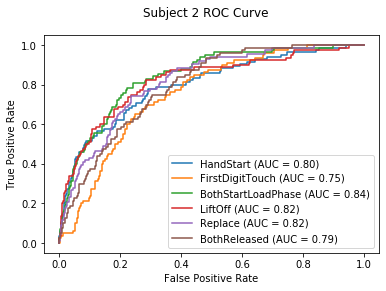

 This page contains the results for each algorithm tested. All three metrics - training time, number of features and the AUROC score are averaged across all subjects. As this is an ongoing project, this page will be updated as different techniques are tried. 

---
---

**Total number of different algorithms: 64**

Tested so far: 
- Single 0.5-80 Hz bandpass filter vs filter bank approach
- No ICA vs eyeblink artifact removal with ICA
- Feature extraction window length - 0.25, 0.5, 1 and 2 seconds
- No PCA vs PCA for dimensionality reduction
- L1 vs L2 penalties in logistic regression

| ICA   | Filter      |   Window length | PCA   | Penalty   |   Train time |   No. feats |   AUROC |
|-------|-------------|-----------------|-------|-----------|--------------|-------------|---------|
| False | bandpass    |            0.5  | False | l2        |        8.048 |     291     |   0.798 |
| False | bandpass    |            0.25 | False | l2        |       18.447 |     291     |   0.788 |
| False | bandpass    |            0.5  | False | l1        |       16.852 |     275.625 |   0.783 |
| False | filter bank |            1    | False | l2        |        7.422 |    1443     |   0.783 |
| False | filter bank |            0.5  | False | l2        |       24.936 |    1443     |   0.782 |
| False | filter bank |            0.25 | False | l2        |       54.911 |    1443     |   0.779 |
| False | bandpass    |            1    | False | l2        |        3.621 |     291     |   0.778 |
| False | bandpass    |            0.25 | False | l1        |       35.112 |     279.819 |   0.778 |
| False | filter bank |            1    | True  | l2        |        0.465 |     398.583 |   0.776 |
| False | filter bank |            1    | False | l1        |       48.758 |    1063.75  |   0.774 |
| False | filter bank |            0.5  | False | l1        |       96.66  |    1264.1   |   0.774 |
| False | filter bank |            0.25 | True  | l2        |        3.298 |     396.833 |   0.772 |
| True  | bandpass    |            0.5  | False | l2        |        7.716 |     291     |   0.772 |
| False | filter bank |            0.25 | False | l1        |      201.602 |    1011.96  |   0.772 |
| False | filter bank |            0.5  | True  | l2        |        1.165 |     315.917 |   0.77  |
| False | filter bank |            1    | True  | l1        |        9.621 |     264.208 |   0.769 |
| False | bandpass    |            0.5  | True  | l2        |        0.592 |      80.917 |   0.769 |
| False | filter bank |            0.25 | True  | l1        |       44.339 |     337.139 |   0.766 |
| True  | bandpass    |            0.25 | False | l2        |       17.19  |     291     |   0.766 |
| False | filter bank |            0.5  | True  | l1        |       15.392 |     252.944 |   0.765 |
| False | bandpass    |            0.5  | True  | l1        |        4.333 |      76.389 |   0.764 |
| False | bandpass    |            1    | False | l1        |        8.453 |     274.319 |   0.762 |
| True  | bandpass    |            0.5  | False | l1        |       16.723 |     279.042 |   0.758 |
| True  | bandpass    |            1    | False | l2        |        2.793 |     291     |   0.758 |
| False | bandpass    |            0.25 | True  | l2        |        0.944 |      87.167 |   0.755 |
| True  | filter bank |            0.5  | False | l2        |       22.737 |    1443     |   0.755 |
| True  | bandpass    |            0.5  | True  | l2        |        0.688 |      95.25  |   0.755 |
| True  | bandpass    |            0.25 | False | l1        |       34.79  |     270.986 |   0.755 |
| True  | filter bank |            0.25 | False | l2        |       60.028 |    1443     |   0.753 |
| False | bandpass    |            0.25 | True  | l1        |        7.45  |      84.736 |   0.752 |
| True  | filter bank |            1    | False | l2        |        7.336 |    1443     |   0.751 |
| True  | bandpass    |            0.5  | True  | l1        |        4.852 |      87.278 |   0.749 |
| False | bandpass    |            1    | True  | l2        |        0.256 |      76.917 |   0.748 |
| True  | filter bank |            0.5  | False | l1        |       96.982 |    1121.1   |   0.746 |
| True  | bandpass    |            1    | False | l1        |        9.098 |     273.958 |   0.746 |
| True  | filter bank |            0.25 | False | l1        |      197.119 |     995.139 |   0.745 |
| True  | filter bank |            1    | True  | l2        |        0.41  |     417.417 |   0.744 |
| True  | bandpass    |            0.25 | True  | l2        |        1.307 |      99.333 |   0.744 |
| True  | filter bank |            0.25 | True  | l2        |        2.642 |     414.5   |   0.744 |
| True  | filter bank |            1    | False | l1        |       51.189 |    1190.67  |   0.743 |
| True  | filter bank |            0.5  | True  | l2        |        1.058 |     326.583 |   0.743 |
| True  | bandpass    |            1    | True  | l2        |        0.26  |      92.583 |   0.742 |
| False | bandpass    |            1    | True  | l1        |        1.95  |      72.181 |   0.742 |
| True  | bandpass    |            0.25 | True  | l1        |        8.721 |      93.153 |   0.741 |
| True  | filter bank |            0.5  | True  | l1        |       17.675 |     253.5   |   0.736 |
| True  | filter bank |            0.25 | True  | l1        |       44.99  |     341.972 |   0.736 |
| True  | bandpass    |            1    | True  | l1        |        2.727 |      76.944 |   0.734 |
| True  | filter bank |            1    | True  | l1        |       10.811 |     255.583 |   0.733 |
| False | filter bank |            2    | False | l2        |        3.889 |    1443     |   0.719 |
| False | filter bank |            2    | True  | l2        |        0.258 |     344.333 |   0.717 |
| False | filter bank |            2    | False | l1        |       27.897 |    1173.81  |   0.716 |
| False | filter bank |            2    | True  | l1        |        4.864 |     236.389 |   0.706 |
| True  | filter bank |            2    | False | l2        |        3.422 |    1443     |   0.701 |
| True  | filter bank |            2    | True  | l2        |        0.245 |     362.083 |   0.697 |
| True  | filter bank |            2    | False | l1        |       26.249 |    1099.14  |   0.69  |
| True  | filter bank |            2    | True  | l1        |        5.192 |     237.736 |   0.685 |
| False | bandpass    |            2    | False | l2        |        1.199 |     291     |   0.684 |
| True  | bandpass    |            2    | False | l2        |        1.402 |     291     |   0.679 |
| False | bandpass    |            2    | True  | l2        |        0.139 |      66     |   0.673 |
| False | bandpass    |            2    | True  | l1        |        0.879 |      49.167 |   0.669 |
| True  | bandpass    |            2    | True  | l2        |        0.175 |      80.917 |   0.668 |
| True  | bandpass    |            2    | True  | l1        |        1.034 |      53.014 |   0.644 |
| False | bandpass    |            2    | False | l1        |        3.578 |     146.181 |   0.611 |
| True  | bandpass    |            2    | False | l1        |        2.948 |     118.875 |   0.6   |

Total run time: ~ 1 day with i5-8250U processor, 4x1.60GHz Cores, 16 GB RAM

Below shows the ROC curve for the best algorithm for subjects 1 and 2. 

